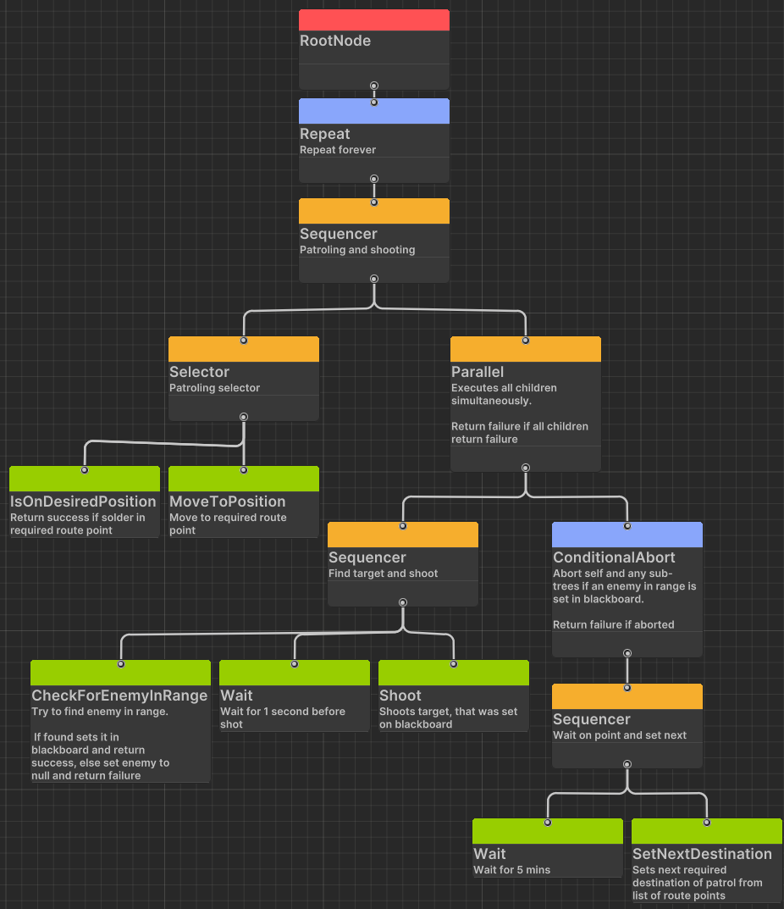

# Saber_Interactive_Interview на должность "Программист игровой логики"

## Задание 1
Условие:
Реализуйте функции сериализации и десериализации двусвязного списка, заданного следующим образом: 
class ListNode 
    class ListNode 

    { 
        public ListNode Prev; 

        public ListNode Next; 

        public ListNode Rand; // произвольный элемент внутри списка 

        public string Data; 

    } 

 

 

    class ListRand 

    { 

        public ListNode Head; 

        public ListNode Tail; 

        public int Count; 

 

        public void Serialize(FileStream s) 

        { 

        } 

 

        public void Deserialize(FileStream s) 

        { 

        } 

    } 
* Алгоритмическая сложность решения должна быть меньше квадратичной.

* Нельзя добавлять новые поля в исходные классы ListNode, ListRand 

* Для выполнения задания можно использовать любой общеиспользуемый язык. 

* Тест нужно выполнить без использования библиотек/стандартных средств сериализации. 

**Решение:** написано на языке python 3.9, файл LinkedListSerialization.py в папке Task1
## Задание 2
Напишите ИИ  для противника используя BhvTree (достаточно нарисовать схему, реализация в каком-либо из движков не требуется). 

Напишите ИИ для противника используя BhvTree (достаточно нарисовать схему, реализация в каком-либо из движков не требуется). 

Солдат - сущность, которая может стрелять, отправиться в указанную точку и ждать. 

Солдат проводит патруль по зацикленному маршруту по точкам А и Б 

По прибытии на точку солдат останавливается на 5 минут в ожидании врага. Если за 5 минут враг не появился, солдат идет на следующую точку. 

Если враг обнаружен, солдат стреляет в него с паузой в 1 секунду между каждым выстрелом 

**Решение:** Дерево было сделано в игровом движке Unity3D с third party плагином. Изображения доступны в папке task 2

Представлено 2 варианта дерева из-за вопросов к условию задачи.

* Вариант дерева с иницализацией маршрута и настройкой паузы перед первым выстрелом.

* Вариант дерева без инциализации маршрута и без настройки паузы перед первым выстрелом

    